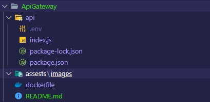

# API GATEWAY
<h2> GATEWAY OF THE MICROMOBILITY PLATFORM</h2>

### MAKES CALLS TO ALL THE MICROSERVICES

<h3 align="left">Used Languages and Tools:</h3>

 
  </a> 
  <a href="https://nodejs.org" target="_blank" rel="noreferrer">  
   

  
# Build and Test

Talk to [Mário Viana](mailto:a13728@alunos.ipca.p) if you need help to setup the project

1.  At the root of the project create a .env file
2.  In the .env file put the Port that is going to be used:   <code> PORT=3000</code>
3.	run command <code>npm install -g</code>  
4.	run command <code>npm start</code>

The .env file should look like this: 
 

# Project Structure
