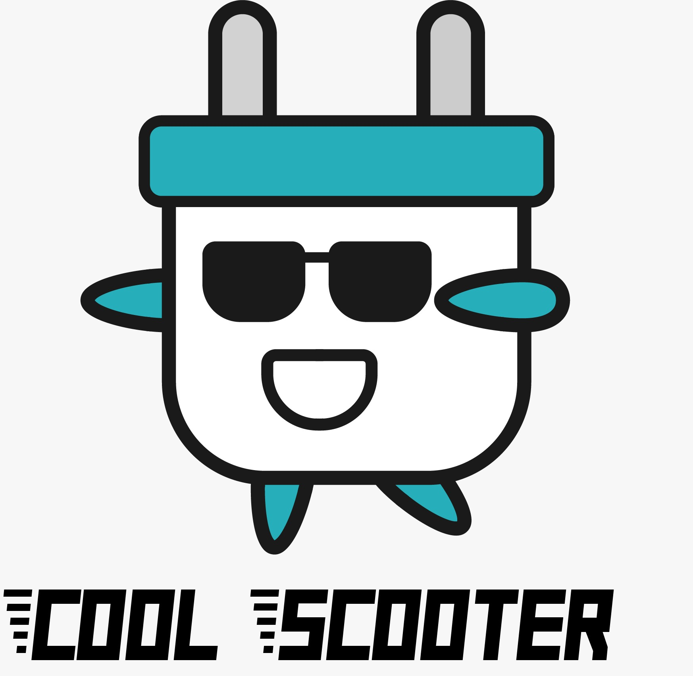

# Introduction

Micro-mobility platform developed in microservices architecture.
Developed by G#10:

- [Mário Viana](mailto:a13728@alunos.ipca.pt)
- [Pedro Pereira](mailto:a17002@alunos.ipca.pt)
- [Wadgero Espitiro Santo](mailto:a22190@alunos.ipca.pt)

# List of Microservices

## [AuthenticationService](/AuthenticationService/README.md)

Entry door to the platform, is responsible for:

- Register users
- Sign up users
- Recover password

## [VehicleManagementService](/VehiclesManagementService/README.md)

Service that manages the vehicles of the platform, responsible for:

- Register new vehicles
- Update vehicles
- Delete vehicles
- Change location of vehicles

## [TripsService](/TripsService/README.md)

Service that manages the trips of the platform, responsible for:

- List all trips
- List all ongoing trips
- List all unfinished trips
- Start new trip
- Finish trip

# Build and Test

Talk to [Mário Viana](mailto:a13728@alunos.ipca.p) if you need help to setup the project

1.  At the root of the project run the command:
      <code> docker-compose up -d</code> for detached mode or <code> docker-composed up attached mode </code>
