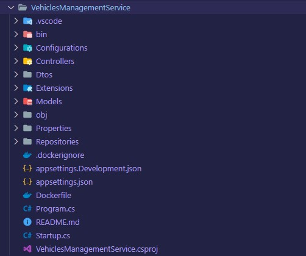

# Vehicles Management Service

## This service is responsible for:

- Register new vehicles
- Update vehicles
- Delete vehicles
- Change location of vehicles

<h3 align="left">Used Languages and Tools:</h3>

 
    
    <a href="https://dotnet.microsoft.com/" target="_blank" rel="noreferrer"> 
    <a href="https://www.mongodb.com/" target="_blank" rel="noreferrer"> 
    
     

# Project Structure
